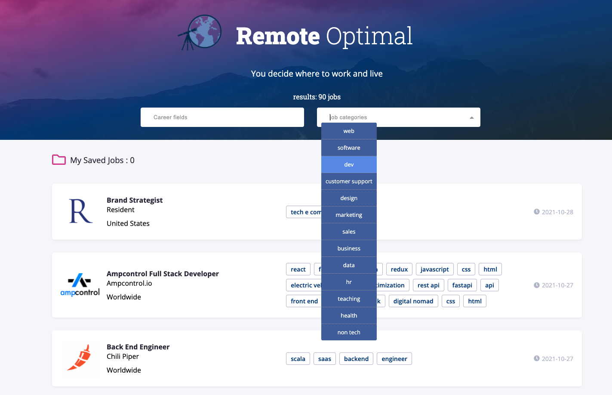

<!-- PROJECT LOGO -->
<br />
<p align="center">
  <a href="https://github.com/othneildrew/Best-README-Template">
    
  </a>

  <h3 align="center">Remotive Optimal</h3>

  <p align="center">
    A platform helps you land your remote career
    <br />
    <br />
    <br />
    <a href="https://remote-optimal.web.app/">View Demo</a>
</p>

<!-- TABLE OF CONTENTS -->
<details open="open">
  <summary>Table of Contents</summary>
  <ol>
    <li>
      <a href="#about-the-project">About The Project</a>
      <ul>
        <li><a href="#built-with">Built With</a></li>
      </ul>
    </li>
    <li><a href="#license">License</a></li>
    <li><a href="#acknowledgements">Acknowledgements</a></li>

  </ol>
</details>

<!-- ABOUT THE PROJECT -->

### Features Version 1.0 (06/15, 2021)

[click here](https://remote-optimal.web.app/) to see the app demo





As a user, you can:

- browse thousands of remote jobs on multiple pages fluently
- search remote jobs by company name, description, title, benefits, and category
- read, apply, save, and manage your job of interest
- log in your account with google

### Built With

- [React](https://reactjs.org/)
- [React Context API](https://reactjs.org/docs/context.html)
- [Firebase](https://firebase.google.com/)

### Implementation Example: Routing

A common issue using react-router to navigate from a page of list of items to that of a single item/ item details is that, when we refresh the item details page, if the item information/data is not independently fetched on this page, we will only get an error of item is undefined. That tells us we need to set our item information as a state and get the item data from the routing provided by the API we use. However, most of the time third-party APIs only provide the route to get the whole list of items without providing one to get item details by item id. Thus, I built my basic routing instead of using React Router in the first version of the project.

Route:

```js
const Route = ({ path, children }) => {
  const [currentPath, setCurrentPath] = useState(window.location.pathname);
  useEffect(() => {
    const onLocationChange = () => {
      setCurrentPath(window.location.pathname);
    };
    window.addEventListener('popstate', onLocationChange);
    return () => {
      window.removeEventListener('popstate', onLocationChange);
    };
  }, []);

  return currentPath === path ? children : null;
};

export default Route;
```

Link:

```js
const Link = ({ className, to, children }) => {
  const jobData = useContext(Jobcontext);
  const { popState } = jobData;

  const onClick = (e) => {
    if (e.metaKey || e.ctrlKey) {
      return;
    }
    e.preventDefault();
    window.history.pushState({}, '', to);
    popState();
  };

  return (
    <a onClick={onClick} className={className} href={to}>
      {children}
    </a>
  );
};

export default Link;
```

To use the route in a component (job component in the case below):

```js
const onClickRedirect = (e) => {
  e.preventDefault();
  window.history.pushState({}, '', `/jobs/${job.id}`);
  popState();
};
```

```js
const AppliedJobItem = ({ job }) => {
  return (
    <div className="job">
      <Link to={`/jobs/${job.id}`}>
        <h4 className="title">{job.position}</h4>
      </Link>
    </div>
  );
};

export default AppliedJobItem;
```

## Acknowledgements

- [Remotive Job API](https://remotive.io/api-documentation)
- [React](https://reactjs.org/)
- [Firebase](https://firebase.google.com/)
- [Font Awesome](https://fontawesome.com)
- [Marked - a markdown parser](https://github.com/chjj/marked)
